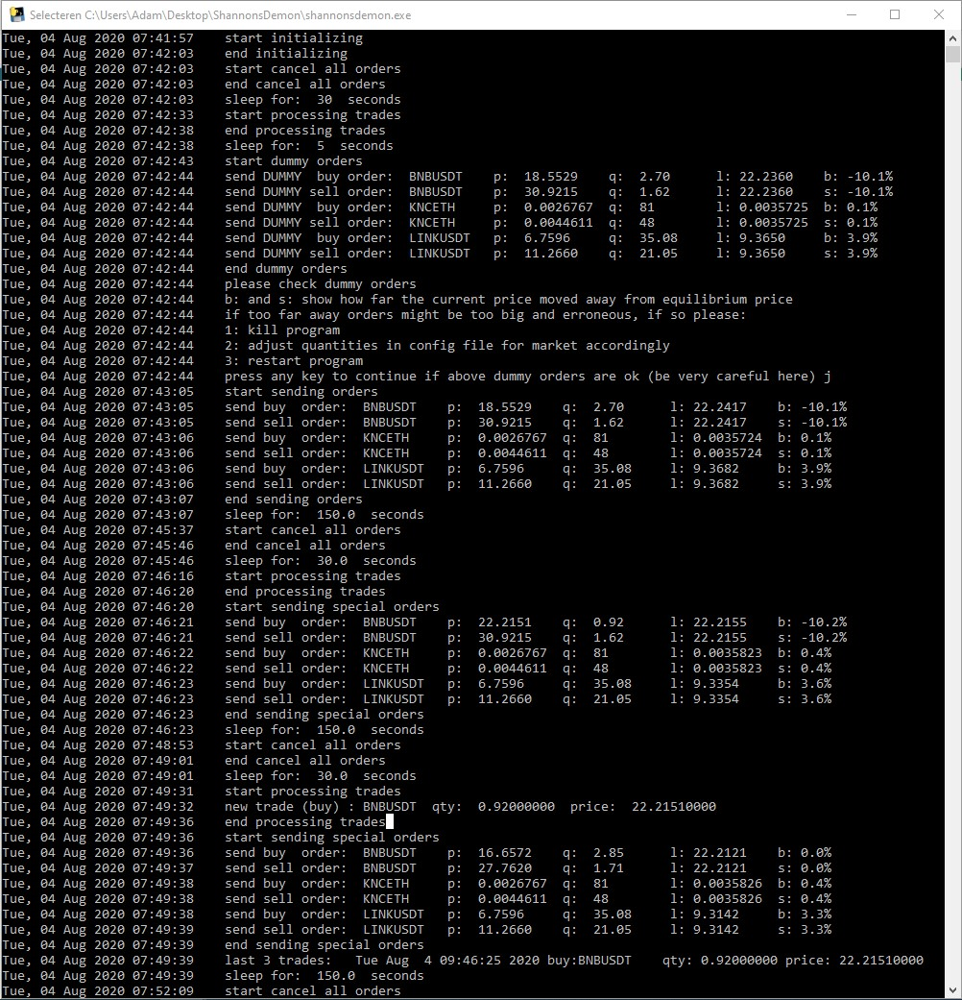
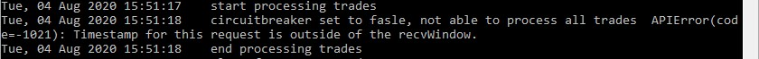

Welcome to the homepage of Shannon's Demon. The trading bot that grows the value of your crypto portfolio exponentially by repeatedly rebalancing your portfolio. For more information about the bot's trading strategy, please check: <a href="https://thepfengineer.com/2016/04/25/rebalancing-with-shannons-demon/">rebalancing-with-shannons-demon</a>. Get your bot running in less than 5 minutes.

<i><b>How Shannon's Demon works...</b></i>  Let's start with a portfolio worth 1000 USD and trade BNBUSDT (<b>market</b>). To start perfectly balanced we need to buy 500 USDT (<b>quote_asset_qty = 500.0</b>) and 500 USDT / 20 BNBUSDT = 25 BNB (<b>base_asset_qty = 25.0</b>) . The price at which we are perfectly balanced (20 BNBUSDT) is called the equilibrium price.

T0: 500 USDT + 25 BNB x 20 BNBUSDT = 1000 USDT.

At time T1 the price decreases to 15 BNBUSDT. Total value is now equal to 875 USDT and in order to be perfectly balanced we need to have 437.5 USDT and 437.5 / 15 = 29.17 BNB. Hence we buy 29.17 - 25 = 4.17 BNB.

T1: 437.5 USDT + 29.17 BNB x 15 BNBUSDT = 875 USDT.

At time T2 the price increases back to 20 BNBUSDT. Total value is now equal to 1020.8 USDT and in order to be perfectly balanced we need to have 510.4 USDT and 510.4 / 20 = 25.52 BNB. Hence we sell 29.17 - 25.52 = 3.65 BNB.

T2: 510.42 USDT + 25.52 BNB x 20 BNBUSDT = 1020.8 USDT.

As you can see in the above example the bot generated a small retrun of approximately 2%. Over time the bot generates many of these small returns which are immediately re-invested, hence the exponential growth. The example shows how the value of your portfolio grows from heavy price fluctuations. This makes the bot ideal for the volatile crypto currency markets.

 
<i><b>How the bot works...</b></i>  
The example above is a simplified explanation of how the bot actually works. The following steps are repeated over and over again until the bot is killed. The executable is started by double clicking it. 
     
1. Cancel all orders. Only orders that were send by your bot are cancelled. Sleep for <b>sleep_seconds_after_cancel_orders</b> seconds.   
2. Process all new trades. Quantities, base qty and quote qty, and <b>fromId</b> are updated. Only trades with id > <b>fromId</b> and trades that were ordered by your bot are processed. <i>Make sure fromId is always set to 0 if you add a new market to the config file.</i>   
3. Send orders. If more than <b>rebalance_interval_sec</b> seconds have passed since last send orders, special orders are send. If not regular orders are send. Sleep for <b>sleep_seconds_after_send_orders</b> seconds.  
Regular orders have a price equal to the equilibrium price multiplied by <b>buy_percentage</b> and <b>sell_percentage</b>. For market BNBUSDT, percentages 0.75 and 1.25 and asset quantities 400 and 16.17, like in above config picture, order prices become (400.0 / 16.17) x 0.75 = 18.5529 and (400.0 / 16.17) x 1.25 = 30.9215. You can see these prices (p:) in the bot picture above. The buy quantity (q:) becomes ((0.5 x (400 + 16.7 x 18.5529)) - 16.7 x 18.5529) / 18.5529 = 2.70. Likewise for the sell order.
  
Special orders make the bot rebalance at the current mid (l:) but only if the mid is more than 5% away from the equilibrium price. In the above bot picture you can see that market BNBUSDT is -10.2% (b: or s:) away from equilibrium price. Hence the bot dimes the best bid at 22.2151. The sell order becomes a regular order. Quantities (q:) are calculated like the example given above.
  
Before the bot follows the above steps, the bot shows DUMMY orders and asks if you want to continue. This way you can check prices. Usually when the price move (b: or s:) shows a large percentage, an error in base and quote quantities or fromId has been made.

* * *

<i><b>Prerequisites...</b>  </i>Download config.json and shannonsdemon.py or shannonsdemon.exe. The config file needs to be stored in the same folder as the python script or the executable. We are aware that running an executable without knowing its publishers is dangerous. You have to trust us or run the python script. For running the python script you have to install python first. For instructions look here: <a href="https://www.python.org/about/gettingstarted/">getting started with python</a>. You also have to install <a href="https://github.com/sammchardy/python-binance">python-binance</a> module for the bot to work.  
For now only Binance is supported. Open a new account here: <a href="https://www.binance.com/nl/register?ref=R9NNDYS8">Binance.</a> Please use this link for a 20% discount in trading fees of which half is send to us. Obviously you can also use an existing account.  
<a href="https://www.binance.com/en/support/articles/360002502072">Create api keys</a> and make sure to have trading option enabled and <i>withdrawal option disabled</i>. Put the api keys in the config file  
Fund your account, make sure you have the right quantities for every market you want to trade and set all other parameters in the config.json file using for example <a href="https://code.visualstudio.com/">Visual Studio Code</a>.

* * *
<i><b>Debugging...</b>  </i>
The most common error that users get when first running their bot, is that their clock is out of sync with Binance server's clock. Please sync your system's or router's clock.

  
For other errors please look in the <a href="https://github.com/binance-exchange/binance-official-api-docs/blob/master/rest-api.md">Binance rest-api documentation</a> or Samm Chardy's <a href="https://python-binance.readthedocs.io/en/latest/">python-binance library</a> or ask a question on our discord channel.
* * *
Contact: <a href="mailto:OmegaArbitrageTrading@outlook.com"><b>OmegaArbitrageTrading@outlook.com</b></a>, <a href="https://discord.gg/mnkE4Xb"><b>https://discord.gg/mnkE4Xb</b></a> or follow us on: <a href="https://twitter.com/OAT68667907"><b>Twitter</b></a>.
* * *
Donate:

ETH:   0x13d55ca40ca3d008b7b0a0118d295f510410b60f

USDT:  0x13d55ca40ca3d008b7b0a0118d295f510410b60f

BTC:   1Fxyo5jfMxkDgGDjiAU9KE7svEG6Drriyv

LTC:   Lbqi2McxsrhM2NR3FtgiMiF2JxswFBsmMX
